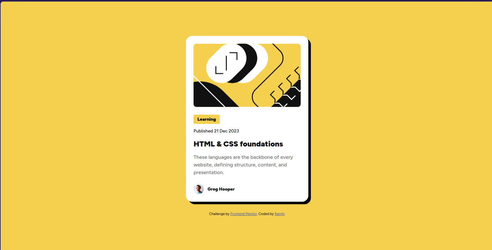

# Frontend Mentor - Blog preview card solution

This is a solution to the [Blog preview card challenge on Frontend Mentor](https://www.frontendmentor.io/challenges/blog-preview-card-ckPaj01IcS). Frontend Mentor challenges help you improve your coding skills by building realistic projects. 

## Table of contents

- [Overview](#overview)
  - [Screenshot](#screenshot)
- [My process](#my-process)
  - [Built with](#built-with)
  - [What I learned](#what-i-learned)
- [Author](#author)

## Overview

### Screenshot

## My process

### Built with

- Semantic HTML5 markup
- CSS custom properties
- Flexbox

### What I learned
From this project i got to understand how to write the HTML markup efficiently in order to make styling easy to code,understand and read.Also i got to understand how to use the css layout option(flexbox) for effecient and appealing layouts.

## Author

- Website - [Ramhi](https://github.com/Ramhi-671?tab=overview&from=2026-05-01&to=2026-05-22)
- Frontend Mentor - [@Ramhi-671](https://www.frontendmentor.io/profile/Ramhi-671)

